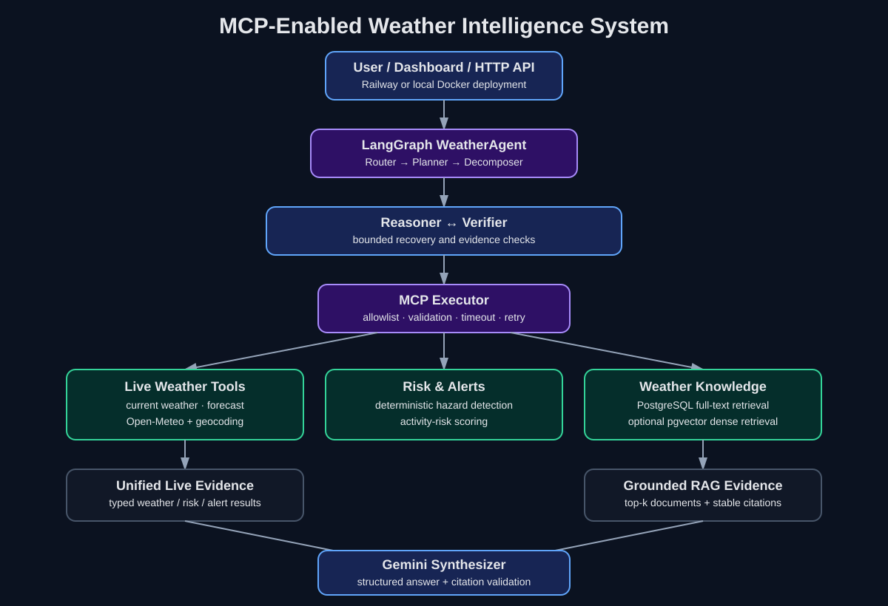

# MCP-Enabled Weather Intelligence System

An **MCP-first, local AI weather intelligence platform** for Indian locations. A local Ollama model discovers and orchestrates weather capabilities through a real **Model Context Protocol (MCP) client/server boundary** instead of directly importing application functions.

The system combines **real-time weather APIs, deterministic hazard intelligence, activity-risk assessment, hybrid RAG, an interactive dashboard, and LLM evaluation** in one local-first application.

> **Core idea:** use MCP as the integration boundary between a local LLM and specialized weather capabilities, then evaluate whether the agent selects the right tools and produces grounded answers.

## Highlights

- **MCP tool orchestration** with dynamic tool discovery over stdio
- **Live weather + 7-day forecast** through Open-Meteo
- **Weather Alerts / Hazard Intelligence** for heavy rain, high rain probability, strong wind, heat, and thunderstorms
- **Deterministic activity-risk scoring** using forecast signals rather than another LLM call
- **Hybrid RAG** using dense retrieval + BM25 + Reciprocal Rank Fusion
- **Interactive Weather Intelligence Dashboard** with live weather, hazards, forecasts, and AI Q&A
- **50-case MCP evaluation benchmark** with tool-selection and latency metrics
- **Answer-quality evaluation** for relevance, groundedness, completeness, and safety
- **Local-first inference** with Ollama; no paid LLM API required

## Architecture



The core runtime path is:

```text
User → Ollama → MCP Client → MCP Server → specialized weather/RAG tools → Ollama synthesis
```

This keeps the LLM separated from application capabilities and makes tool discovery, routing, and evaluation explicit.

## MCP Tools

| Tool | Purpose |
|---|---|
| `get_weather` | Current weather and 7-day forecast for an Indian location |
| `get_weather_alerts` | Detect forecast-based hazards and return severity + recommendations |
| `assess_weather_risk` | Deterministic activity-risk assessment from live forecast signals |
| `search_weather` | Hybrid dense + BM25 weather knowledge retrieval |
| `sync_weather` | Refresh weather data for configured locations |
| `database_health` | Check the configured database backend |
| `ask_weather` | Existing grounded RAG answer path, kept outside the agent to avoid nested LLM calls |

The normal agent exposes the weather, alert, risk, and retrieval capabilities needed for tool orchestration. Risk and hazard analysis use deterministic application logic rather than another LLM request.

### Hazard Intelligence

`get_weather_alerts` is an **application-level forecast hazard detector**, not an official government warning service. It analyzes live forecast signals and returns practical recommendations for:

- Heavy rain
- High precipitation probability
- Strong wind
- High / extreme heat
- Thunderstorms

Each alert includes a date, severity, details, and recommendation. The API and dashboard surface the same hazard results.

## Dashboard

The Flask application provides an interactive **Weather Intelligence Dashboard** at:

```text
http://127.0.0.1:8000/
```

The UI supports:

- Location-based current weather lookup
- Forecast information
- Hazard / alert cards
- Highest-severity warning summary
- AI weather questions
- Activity-oriented weather intelligence

The dashboard is backed by the same Flask API and MCP/RAG components rather than a separate demo implementation.

### Quick Demo

```bash
python app.py
```

Then open `http://127.0.0.1:8000/`, search for an Indian city such as **Kolkata**, and test:

> Is Kolkata suitable for outdoor activities tomorrow?

For a CLI demo without the dashboard:

```bash
python weather_agent.py "Are there any dangerous weather alerts for Kolkata this week?"
```

## Evaluation

The project contains an evaluation layer in addition to the unit and integration test suite. Tests protect implementation correctness; evaluations measure **agent behavior and answer quality**.

### MCP Tool-Selection Evaluation

The benchmark contains **50 realistic cases** across five categories:

| Category | Cases | Latest result |
|---|---:|---:|
| Current weather / forecast | 10 | 100% |
| Activity risk | 10 | 100% |
| Weather alerts | 10 | 100% |
| Weather knowledge | 10 | 100% |
| Comparisons | 10 | 90% |
| **Overall** | **50** | **98%** |

Latest local benchmark results:

- **98% tool-selection exact accuracy**
- **100% expected-tool recall**
- **100% location-argument accuracy**
- **3.69 s P50 tool-selection latency**
- **7.47 s P95 tool-selection latency**

Run it with:

```bash
python evaluation/evaluate_agent.py
```

The evaluator stores per-case predictions and metrics in `evaluation/results.json`.

### Answer-Quality Evaluation

A second evaluation layer scores generated answers using an LLM-as-a-judge approach across:

- **Relevance**
- **Groundedness**
- **Completeness**
- **Safety**

Latest local benchmark result on the current answer set:

| Metric | Score |
|---|---:|
| Relevance | 4.4 / 5 |
| Groundedness | 4.7 / 5 |
| Completeness | 3.7 / 5 |
| Safety | 4.6 / 5 |
| All dimensions ≥ 4 | 80% |

Run it with:

```bash
python evaluation/evaluate_answers.py
```

Results are written to `evaluation/answer_results.json`.

The evaluations are intentionally separate from `pytest`: a passing unit test does not prove that an LLM selected the correct MCP tool or generated a complete, grounded answer.

## Key Technologies

- **MCP v2** — protocol-based tool discovery and orchestration
- **Ollama** — local LLM inference
- **Open-Meteo** — weather and forecast data
- **OpenStreetMap Nominatim** — Indian location/geocoding resolution
- **Sentence Transformers** — dense embeddings
- **BM25** — lexical retrieval
- **Reciprocal Rank Fusion (RRF)** — hybrid retrieval ranking
- **PostgreSQL / pgvector** — persistence and vector search
- **Flask** — dashboard and HTTP API
- **Python** — application and MCP implementation

## Local Setup

### 1. Clone the repository

```bash
git clone https://github.com/Atul1127/MCP-Enabled-Weather-Intelligence-System.git
cd MCP-Enabled-Weather-Intelligence-System
```

### 2. Create a virtual environment

Git Bash on Windows:

```bash
python -m venv .venv
source .venv/Scripts/activate
```

PowerShell:

```powershell
python -m venv .venv
.venv\Scripts\Activate.ps1
```

### 3. Install dependencies

```bash
python -m pip install --upgrade pip
python -m pip install -r requirements.txt
```

Using a project virtual environment is recommended so unrelated global packages do not introduce dependency conflicts.

### 4. Make sure Ollama is running

The default local model is:

```text
llama3.2:3b
```

You can change the agent model without editing code:

```bash
export WEATHER_AGENT_MODEL=qwen3:4b
```

The RAG answer path can be configured independently with `WEATHER_LLM_MODEL`.

### 5. Run the MCP smoke test

```bash
python mcp_client.py
```

This starts the MCP server through stdio, initializes a real MCP client session, discovers the tools, and performs a sample weather call.

### 6. Run the local agent

```bash
python weather_agent.py "What is the current weather in Kolkata?"
```

Risk example:

```bash
python weather_agent.py "Is Kolkata suitable for outdoor activities tomorrow? Explain the main risks."
```

Alert example:

```bash
python weather_agent.py "Are there any dangerous weather alerts for Kolkata this week?"
```

Comparison example:

```bash
python weather_agent.py "Compare the current weather in Kolkata and Delhi."
```

### 7. Run the dashboard

```bash
python app.py
```

Open `http://127.0.0.1:8000/`.

Useful API endpoints:

```text
GET  /healthz
POST /weather/current
POST /weather/alerts
POST /weather/ask
POST /weather/sync
```

Example alert request:

```bash
curl -X POST http://127.0.0.1:8000/weather/alerts \
  -H "Content-Type: application/json" \
  -d '{"location":"Kolkata"}'
```

### 8. Run tests

```bash
python -m pytest -q
```

MCP integration tests can be run independently:

```bash
python -m pytest tests/test_mcp_client.py -q
```

### 9. Run evaluations

Tool selection:

```bash
python evaluation/evaluate_agent.py
```

Answer quality:

```bash
python evaluation/evaluate_answers.py
```

## Docker

Docker Compose provides the Flask/RAG API and PostgreSQL + pgvector database. Ollama remains on the host so model weights do not need to be placed inside the application image.

```bash
docker compose up --build
```

The API is available on port `8000`. The MCP agent is normally run locally with `python weather_agent.py` so it can launch the MCP server over stdio.

## Performance Design

The local agent is intentionally bounded for practical laptop inference:

- Small local model by default
- Maximum two agent rounds
- MCP tool schemas discovered once per session
- Independent MCP tool calls can execute concurrently
- Local model kept alive for repeated requests
- Deterministic risk scoring avoids an extra LLM call
- RAG is lazily imported by the MCP server, so simple weather/risk requests do not initialize the embedding model
- `ask_weather` is not exposed to the normal agent because it would create a nested LLM call

Simple weather flow:

```text
Ollama tool selection
        -> MCP get_weather
        -> Open-Meteo
        -> Ollama final synthesis
```

Decision flow:

```text
Ollama tool selection
        -> MCP assess_weather_risk
        -> live forecast + deterministic scoring
        -> Ollama final synthesis
```

Hazard flow:

```text
Ollama tool selection
        -> MCP get_weather_alerts
        -> forecast hazard rules
        -> Ollama final synthesis
```

## RAG Pipeline

The weather knowledge pipeline combines dense and lexical retrieval:

```text
Query
  |
  +--> Dense retrieval
  |
  +--> BM25 retrieval
  |
  +--> Reciprocal Rank Fusion
  |
  v
Relevant weather evidence
  |
  v
Local Ollama synthesis
```

RAG is the supporting knowledge layer; **MCP is the primary integration and orchestration concept**.

## Cost

The development stack is designed for **₹0 API cost**:

- Local Ollama inference
- MCP Python SDK
- Open-Meteo free weather API
- Local retrieval components
- Local application runtime

No OpenAI or Gemini API key is required.

## Project Structure

```text
mcp_server.py                    MCP server and weather/RAG tools
mcp_client.py                    MCP stdio client and tool discovery
weather_agent.py                 Ollama -> MCP agent loop
weather_client.py                Indian location + weather data client
rag_service.py                   Hybrid weather retrieval/RAG
app.py                           Flask API + dashboard server
templates/dashboard.html         Weather Intelligence Dashboard
evaluation/dataset.json          50-case MCP agent benchmark
evaluation/evaluate_agent.py     Tool-selection evaluation
evaluation/answer_dataset.json   Answer-quality benchmark
evaluation/evaluate_answers.py   Answer-quality evaluation
docs/architecture.svg            Architecture diagram
notebooks/                       Weather embedding/ingestion work
scripts/                         Data ingestion utilities
resources/                       Ingestion configuration
sql/                             Weather/database schema
tests/                           API, retrieval, RAG and MCP tests
Dockerfile                       Flask/RAG container image
docker-compose.yml               PostgreSQL + pgvector local stack
```

## Project Focus

The project is intentionally focused on one core engineering problem:

> **How can a local LLM safely discover and orchestrate external weather capabilities through MCP to produce useful, evidence-grounded answers?**

Weather is the demonstration domain; the MCP client/server architecture is the primary reusable engineering concept.

## Limitations

- Hazard detection is based on forecast signals and deterministic thresholds; it is **not an official emergency-alert system**.
- Evaluation scores depend on the local model, benchmark composition, and evaluation-judge model.
- The current 50-case tool benchmark is a regression benchmark, not a claim of production-level reliability.
- Local inference latency depends heavily on hardware and model size.

## License

See the repository license for usage terms.
